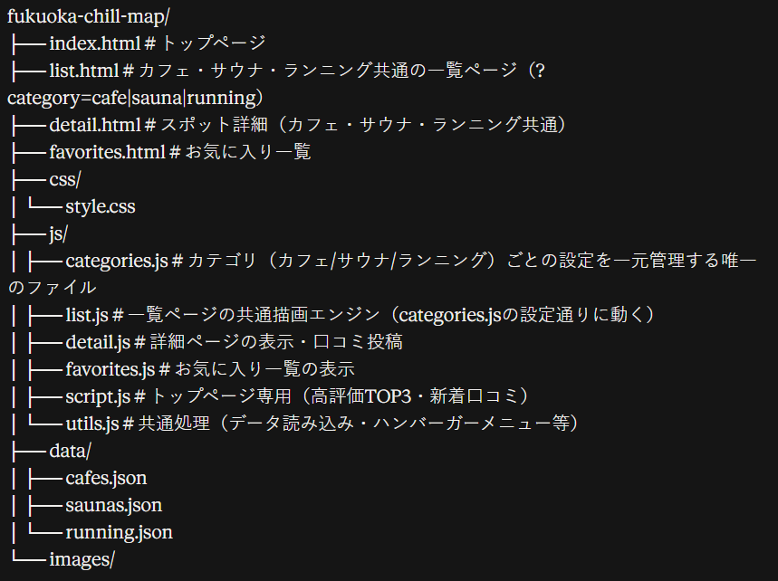

# fukuoka-chill-map

福岡のカフェ・サウナ・ランニングスポットを紹介するWebサイトです。

## 使用技術

- HTML
- CSS
- JavaScript（フレームワーク不使用 / LocalStorageでデータ保存）

## 実装済み機能

- カフェ・サウナ・ランニング共通の一覧ページ（検索・チェックボックス絞り込み・エリア絞り込み・並び替え）
- スポット詳細ページ（カフェ・サウナ・ランニング共通の1ページで、カテゴリごとに表示項目を出し分け）
- Googleマップ埋め込み表示
- 口コミ・評価投稿機能（LocalStorageに保存）
- お気に入り登録・一覧表示（LocalStorageに保存）
- トップページに高評価TOP3・新着口コミを表示
- スマホ対応レイアウト（ハンバーガーメニュー）

## ディレクトリ構成

### カテゴリ管理の仕組み

カフェ・サウナ・ランニングの「絞り込み項目」「並び替え候補」「検索対象」「データファイル名」などは、
すべて `js/categories.js` の `CATEGORY_CONFIG` にまとめて定義している。

一覧ページ（`list.html`）は `?category=cafe` のようにURLでカテゴリを受け取り、
`list.js` が `CATEGORY_CONFIG` の内容だけを見て検索欄・チェックボックス・並び替えUI・カードを動的生成する。
詳細ページ（`detail.html`）も同様に `?type=cafe` を受け取り、`detail.js` が該当カテゴリの項目だけを表示する。

**表示項目を追加・変更したいときは `js/categories.js` を編集するだけでよく、
`list.html` / `list.js` / `detail.html` を直接触る必要はない。**

## 今後追加予定

- 検索条件をURLに反映（条件付きリンクの共有）
- 検索候補・オートコンプリート
- ページネーション / 表示件数の絞り込み
- 口コミ・お気に入りデータのサーバー保存化（現状はLocalStorageのみで端末依存）
