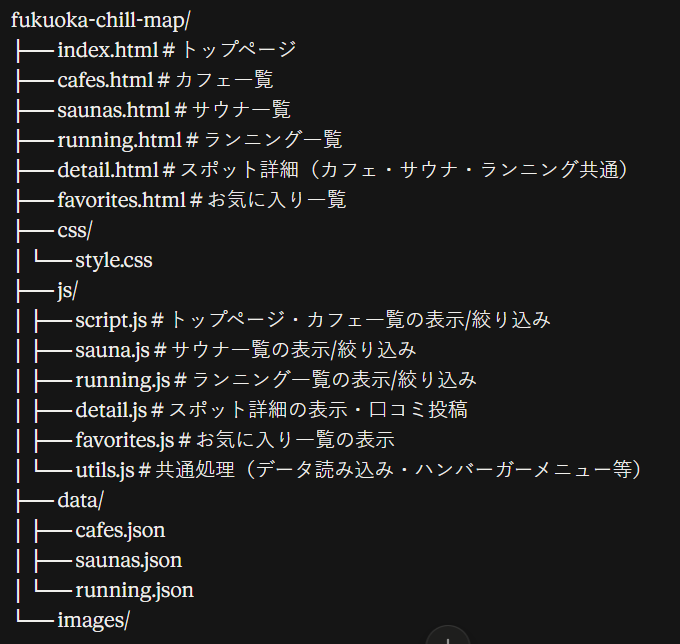

# fukuoka-chill-map

福岡のカフェ・サウナ・ランニングスポットを紹介するWebサイトです。

## 使用技術

- HTML
- CSS
- JavaScript（フレームワーク不使用 / LocalStorageでデータ保存）

## 実装済み機能

- カフェ一覧・検索・絞り込み（キーワード / Wi-Fi / 電源 / エリア）
- サウナ一覧・検索・絞り込み（キーワード / 温泉 / ロウリュ / 宿泊 / 駐車場 / エリア）
- ランニングコース一覧・検索・絞り込み（キーワード / 夜間照明 / ロッカー / トイレ / エリア）
- スポット詳細ページ（カフェ・サウナ・ランニング共通の1ページで、カテゴリごとに表示項目を出し分け）
- Googleマップ埋め込み表示
- 口コミ・評価投稿機能（LocalStorageに保存）
- お気に入り登録・一覧表示（LocalStorageに保存）
- トップページに高評価TOP3・新着口コミを表示
- スマホ対応レイアウト（ハンバーガーメニュー）

## ディレクトリ構成

### スポット詳細ページの仕組み

`detail.html` はカフェ・サウナ・ランニング共通の1ページになっています。
一覧ページからのリンクに `?name=店名&type=cafe|sauna|running` の形で種別を渡し、
`detail.js` 内の `FIELD_CONFIG` に定義された項目だけをカテゴリごとに動的表示します。

表示項目を追加・変更したい場合は、`js/detail.js` の `FIELD_CONFIG` を編集するだけで、
該当カテゴリの一覧・詳細すべてに反映されます。

## 今後追加予定

- 口コミ・お気に入りデータのサーバー保存化（現状はLocalStorageのみで端末依存）
- 詳細ページからの口コミ削除・編集機能
- カフェ・サウナ・ランニング以外のカテゴリ追加（公園、夜景スポットなど）
- 検索候補・並び替え機能（評価順・距離順など）
